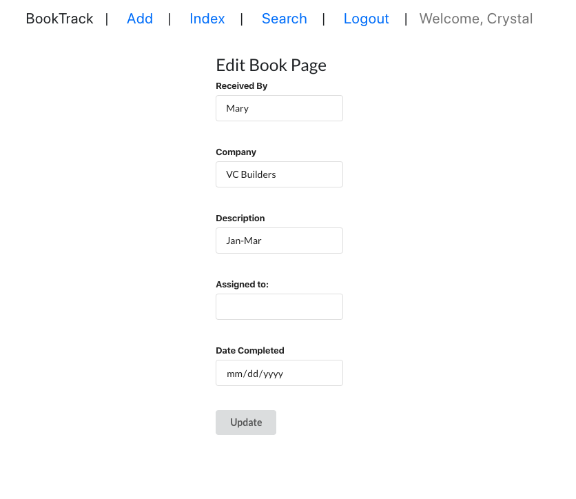

# BookTrack

### Description

BookTrack was created to help Bookkeepers track their bookkeeping. Once a book is received, you can add it to your index. The next step is to assign it to a bookkeeper to work on it which you can update it by clicking the edit button. You can update one last time to add in the completed date. 

### Screenshots: 

### Technologies Used: 
- React
- Node
- Express
- Mongoose
- HTML
- CSS
- Chajr
- Semanic UI React
- Bootstrap
  

### Getting Started: 

[Link to the App](https://booktrack1.herokuapp.com/)

[Link to Trello Board](https://trello.com/b/PlpP16sB/booktrack)

### Next Steps: 

- [ ] Search tab to search the books by company name and by received date
- [ ] Add a sort button on the index page to sort by Company Name

