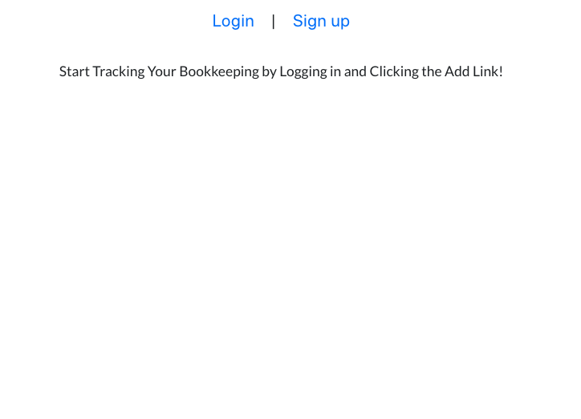
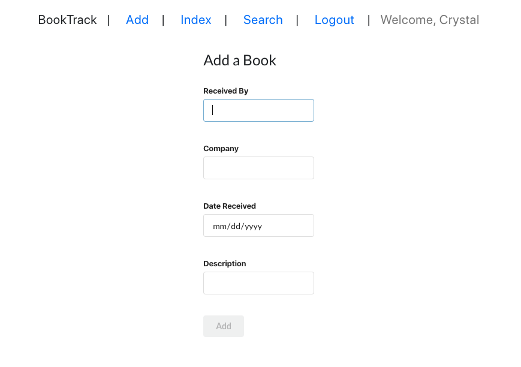

# BookTrack

### Description

BookTrack was created to help Bookkeepers track their bookkeeping. BookTrack allows you to add a book by and update it to know who you assigned it to.

### Screenshots: 

### Technologies Used: 
    * React
    * Node
    * Mongoose
    * Chajr
  

### Getting Started: 

[A link to the App](https://booktrack1.herokuapp.com/)

[Trello](https://trello.com/b/dcMyTCvB/into-the-unknown-travel-app)

### Next Steps: 

- [ ] Search tab to search the books by company name and by received date

